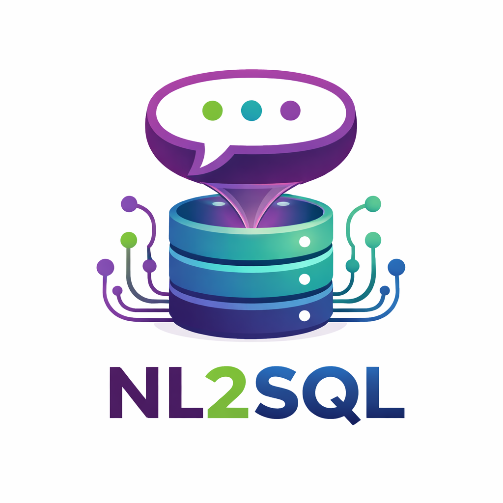

<p align="center">
  
</p>

# NL2SQL

An [MCP (Model Context Protocol)](https://modelcontextprotocol.io/) server that converts natural language questions into PostgreSQL queries using local LLMs via Ollama. Connect it to any MCP-compatible client — [LibreChat](https://www.librechat.ai/), [Claude Desktop](https://claude.ai/download), or your own internal applications — and let users query databases in plain English.

The server uses a multi-stage validation and repair pipeline, achieving **88.3% accuracy** on an 86-table enterprise database and **76% on 2,000+ tables**.

> **Platform:** All setup and run scripts target **Linux (Bash)**. macOS may work with minor adjustments; Windows requires WSL.

## Performance

| Database | Tables | Questions | Accuracy | Model |
|----------|--------|-----------|----------|-------|
| Enterprise ERP | 86 | 60 | **88.3%** | qwen2.5-coder:7b |
| Enterprise ERP (expanded) | 2,377 | 300 | **76.0%** | qwen2.5-coder:7b |

These results are against a **single large enterprise database** (one ERP system, 8 modules: HR, Finance, Sales, Inventory, Procurement, Projects, Assets, Common). This is a different challenge from benchmarks like [BIRD](https://bird-bench.github.io/) which test across 95 small/medium databases spanning 37 domains. See [Benchmark Context](#benchmark-context) for details.

## MCP Integration

This server implements the [Model Context Protocol](https://modelcontextprotocol.io/) and exposes three tools:

| Tool | Purpose |
|------|---------|
| `nl_query` | Natural language to SQL — the main pipeline |
| `query` | Execute raw SQL (role-gated: read/insert/write/admin) |
| `checkpoint` | Database checkpoint management (undo/redo) |

It also exposes resources for schema browsing (`postgres://tables`, `postgres://tables/{name}/schema`).

### Connecting to LibreChat

Add the server to your `librechat.yaml`:

```yaml
mcpServers:
  nl2sql:
    type: stdio
    command: npx
    args:
      - tsx
      - /path/to/nl2sql-project/mcp-server-nl2sql/src/stdio.ts
    env:
      DB_PASSWORD: "your_password"
      OLLAMA_MODEL: "qwen2.5-coder:7b"
    timeout: 60000
```

Restart LibreChat. The `nl_query` tool will appear in the tool list.

For full LibreChat MCP configuration details, see the [LibreChat MCP docs](https://www.librechat.ai/docs/features/mcp).

### Connecting to Claude Desktop

Add to your Claude Desktop MCP config (`~/.claude/mcp.json` or via the UI):

```json
{
  "mcpServers": {
    "nl2sql": {
      "command": "npx",
      "args": ["tsx", "/path/to/nl2sql-project/mcp-server-nl2sql/src/stdio.ts"],
      "env": {
        "DB_PASSWORD": "your_password"
      }
    }
  }
}
```

### Connecting to Any MCP Client

The server communicates over **stdio** (stdin/stdout). Any application that implements the MCP client protocol can connect. The entry point is `mcp-server-nl2sql/src/stdio.ts`.

## Architecture

```
MCP Client (LibreChat, Claude Desktop, custom app)
     |  (MCP protocol over stdio)
     v
+---------------------------+     +---------------------+     +--------+
| TypeScript MCP Server     |---->| Python Sidecar      |---->| Ollama |
|                           |     | (FastAPI :8001)      |     | (LLM)  |
| 1. Module Routing         |     |                     |     +--------+
| 2. Schema Retrieval (RAG) |     | - Parallel K-SQL    |
| 3. Prompt Construction    |     |   generation        |
|    (glosses + linker +    |     | - Repair prompts    |
|     join planner)         |     +---------------------+
| 4. Multi-Candidate Eval   |
|    (validate + EXPLAIN +  |     +---------------------+
|     score + rerank)       |     | PostgreSQL          |
| 5. Repair Loop (max 3)   |---->| - Target DB (query) |
|    (surgical whitelist)   |     | - pgvector (RAG)    |
| 6. Execute on PostgreSQL  |     +---------------------+
+---------------------------+
     |
     v
  SQL Results (returned to MCP client)
```

## Quick Start

> **Requires Linux/Bash.** See [Prerequisites](#prerequisites) below.

```bash
# 1. Clone
git clone <repo-url> && cd nl2sql-project

# 2. Run the demo (~5 min — installs deps, sets up DB, runs 10 questions)
./demo/demo.sh

# 3. Or step by step:
./scripts/setup-deps.sh          # Check prereqs, install npm/pip, pull model
./demo/setup-db.sh               # Create DB, load data, populate embeddings
./scripts/start-sidecar.sh --bg  # Start Python sidecar
./demo/run-exam.sh               # Run full 60-question exam
```

### Prerequisites

- **Linux** (or WSL on Windows) — all shell scripts use Bash
- PostgreSQL 14+ with pgvector extension
- Node.js >= 18
- Python >= 3.10
- Ollama (with a supported model)

## Project Structure

```
nl2sql-project/
+-- config/                    # Unified YAML configuration
|   +-- config.yaml            # Default settings (committed)
|   +-- config.example.yaml    # Template for new setups
+-- mcp-server-nl2sql/         # TypeScript MCP server (core pipeline)
|   +-- src/                   # Source files
|   +-- scripts/               # Exam runners, embedding tools
+-- python-sidecar/            # Python FastAPI service (LLM interface)
+-- scripts/                   # Generic scripts (any database)
|   +-- setup-deps.sh          # Install prerequisites
|   +-- start-sidecar.sh       # Start/stop Python sidecar
+-- demo/                      # Demo databases + exams
|   +-- enterprise-erp/        # 86-table ERP schema, data, RAG setup
|   +-- schema_gen/            # 2000-table schema generation (Jinja)
|   +-- data_gen/              # 2000-table data generation
|   +-- exam/                  # Exam CSVs, templates, grading
|   +-- validation/            # DB validation scripts
|   +-- demo.sh                # One-command demo
|   +-- setup-db.sh            # DB setup orchestrator
|   +-- run-exam.sh            # Exam runner
+-- docs/                      # Documentation
+-- STATUS.md                  # Current performance numbers
```

## Configuration

All settings live in `config/config.yaml`. Override with:
- `config/config.local.yaml` (gitignored, for local secrets/tuning)
- Environment variables (same names as before: `OLLAMA_MODEL`, `DB_PASSWORD`, etc.)

Precedence: **ENV > config.local.yaml > config.yaml**

See [docs/CONFIG.md](docs/CONFIG.md) for the full reference.

## Key Features

- **MCP server** — Plug into LibreChat, Claude Desktop, or any MCP client
- **Schema RAG** — pgvector similarity search + BM25 + RRF fusion retrieves relevant tables from 2,000+
- **Multi-candidate generation** — K parallel LLM calls (temp=0.3), deterministic scoring, no LLM judge
- **Surgical whitelist repair** — Two-tier gating for column error (42703) recovery
- **Pipeline upgrades** — Schema glosses, schema linker, join planner, PG normalization, candidate reranker
- **Module routing** — Keyword + embedding classification narrows retrieval to 1-3 modules

## SQL Dialect Support

The pipeline is currently **PostgreSQL-specific**. Key PG-coupled components:

| Component | PG-Specific? | What would change for MySQL/SQLite |
|-----------|-------------|-------------------------------------|
| LLM prompts | Yes — "Generate PostgreSQL SELECT" | Parameterize dialect in prompt templates |
| `pg_normalize.ts` | Yes — converts MySQL/Oracle syntax TO PG | Write reverse normalizer per dialect |
| EXPLAIN validation | Yes — uses `EXPLAIN (FORMAT JSON)` | Use dialect-native EXPLAIN |
| pgvector (embedding store) | Yes — PG extension | Use external vector DB (Pinecone, etc.) |
| `sql_validator.ts` | Mostly portable | Swap PG-specific dangerous function list |
| Schema introspection | Mostly portable | Uses standard `information_schema` |

**If your target database is MySQL but you're fine running PostgreSQL for the RAG/embedding layer**, the main work is swapping the prompt templates and normalizer. The pgvector embedding store and the target query database are on the same PostgreSQL instance today, but architecturally they could be separated — the RAG layer only needs vector similarity search, while query execution needs the target database.

See [docs/SQL_DIALECTS.md](docs/SQL_DIALECTS.md) for a full guide on dialect support.

## Benchmark Context

Our evaluation tests a **single large enterprise database** (one ERP schema with 86 base tables, expandable to 2,377 tables across 20 divisions). This measures how well the system handles:
- Large schema retrieval (finding the right 5-10 tables from 2,000+)
- Complex inter-module joins (HR + Finance + Projects)
- Dirty/ambiguous naming conventions

This is complementary to benchmarks like **[BIRD](https://bird-bench.github.io/)**, which tests across **95 databases spanning 37 domains** (healthcare, finance, sports, etc.) with 12,751 questions. BIRD measures cross-domain generalization and external knowledge requirements. Our benchmark measures depth within a single complex schema.

| Benchmark | Databases | Tables (total) | Questions | Focus |
|-----------|-----------|----------------|-----------|-------|
| **Ours (86-table)** | 1 | 86 | 60 | Single-DB depth, enterprise ERP |
| **Ours (2,377-table)** | 1 | 2,377 | 300 | Large-schema retrieval at scale |
| **BIRD** | 95 | ~5,000 | 12,751 | Cross-domain breadth, dirty data |
| **Spider** | 200 | ~1,000 | 10,181 | Cross-domain, clean schemas |

## Documentation

| Doc | Description |
|-----|-------------|
| [MCP_INTEGRATION.md](docs/MCP_INTEGRATION.md) | Connecting to LibreChat, Claude Desktop, and custom apps |
| [PIPELINE.md](docs/PIPELINE.md) | Stage-by-stage pipeline walkthrough |
| [CONFIG.md](docs/CONFIG.md) | Full YAML config reference |
| [MODELS.md](docs/MODELS.md) | Tested models and how to swap |
| [EXAMS.md](docs/EXAMS.md) | Running and creating exams |
| [SQL_DIALECTS.md](docs/SQL_DIALECTS.md) | SQL dialect support and how to add new dialects |
| [ADDING_A_DATABASE.md](docs/ADDING_A_DATABASE.md) | How to add a new database |
| [TROUBLESHOOTING.md](docs/TROUBLESHOOTING.md) | Common issues and fixes |
| [REFACTOR_PLAN.md](docs/REFACTOR_PLAN.md) | Future improvements |

## Running Exams

```bash
# 86-table (60 questions)
./demo/run-exam.sh

# 2,377-table (300 questions, or subset)
./demo/run-exam.sh --db=2000
./demo/run-exam.sh --db=2000 --max=10

# Multiple runs for statistical mean
./demo/run-exam.sh --runs=3
```

## License

ISC
